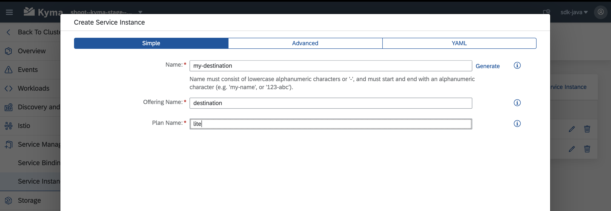
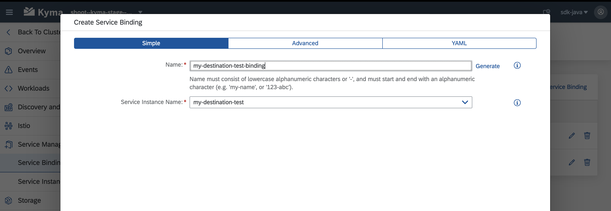

import Tabs from '@theme/Tabs';
import TabItem from '@theme/TabItem';

[Kyma](https://kyma-project.io/) is an application runtime that provides you a flexible and easy way to connect, extend, and customize your applications in the cloud-native world of Kubernetes.
Find more details in the [official documentation](https://kyma-project.io/docs/kyma/latest/01-overview/).

You can also refer to this additional material available for getting started with SAP Cloud SDK on Kyma:

- [Sample Application with Setup Guide](https://github.com/SAP-samples/kyma-runtime-extension-samples/tree/main/sample-cloudsdk-java)
- [Blog Post on a Sample Use Case](https://blogs.sap.com/2022/01/11/use-sap-cloud-sdk-on-kyma-runtime-to-connect-to-external-systems-with-client-cert-authentication/)
- [Using the Service Catalog with the SAP Cloud SDK](https://sap.github.io/cloud-sdk/docs/java/environments/sap-btp-kubernetes-environment-with-sap-gardener#excursion-bind-services-created-by-the-service-catalog)

## SAP Cloud SDK Features Supported on Kyma by SAP

The SAP Cloud SDK supports the Kyma runtime through the regular Cloud Foundry specific modules and classes.
Hence, Cloud Foundry application developers usually don't need to adjust their code to deploy and run it on Kyma.

Nevertheless, before deploying your application on a Kyma cluster, please ensure that following dependency is on the classpath: [`com.sap.cloud.environment.servicebinding:java-sap-service-operator`](https://central.sonatype.com/artifact/com.sap.cloud.environment.servicebinding/java-sap-service-operator).

Find below the list of features we currently support:
Legend: ✅ - supported, ❗- partially supported, ❌ - not supported

- ✅ Consume SAP BTP services like Destination, Connectivity, IAS, XSUAA, and others
- ✅ Multitenancy
- ✅ Resilience & Caching
- ✅ Connect to and consume services from SAP S/4HANA Cloud
- ❗ Connect to and consume services from SAP S/4HANA On-Premise
- ✅ Seamless use of typed clients provided by the SAP Cloud SDK

## Getting Started with the SAP Cloud SDK on Kyma

This detailed guide will help get your SAP Cloud SDK Java application up and running in Kyma.
You can also use this guide to migrate your existing application to Kyma.

### Prerequisites

To follow this guide you will need:

- An [SAP BTP Kyma environment](https://help.sap.com/products/BTP/65de2977205c403bbc107264b8eccf4b/09dd313bf6644250a14f8f38c3d644c0.html?locale=en-US) instance
- [Docker](https://www.docker.com/) and a publicly reachable Docker repository
- A [Spring Boot](https://spring.io/projects/spring-boot) Application using the SAP Cloud SDK

:::tip Tip

When deploying applications to Kyma, you are not limited to Spring Boot applications.
In fact, you may deploy any application that can be executed within a Docker container.
The examples in this document, however, do use a Spring Boot app.

:::

Check out the details below in case you are uncertain about any of the prerequisites.

<details>
  <summary>Kyma Environment</summary>

This guide assumes you already have a Global Account, a subaccount on SAP BTP platform and have [Kubernetes CLI](https://kubernetes.io/docs/tasks/tools/#kubectl) installed on your local machine.
If not, please refer to these guides on getting a [Global Account](https://help.sap.com/products/BTP/65de2977205c403bbc107264b8eccf4b/d61c2819034b48e68145c45c36acba6e.html?locale=en-US) and creating a [subaccount](https://help.sap.com/products/BTP/65de2977205c403bbc107264b8eccf4b/05280a123d3044ae97457a25b3013918.html?locale=en-US)

In your subaccount in SAP BTP cockpit, create a [Kyma Environment instance](https://help.sap.com/products/BTP/65de2977205c403bbc107264b8eccf4b/09dd313bf6644250a14f8f38c3d644c0.html?locale=en-US).
Make sure that you select an appropriate [plan](https://help.sap.com/products/BTP/65de2977205c403bbc107264b8eccf4b/befe01d5d8864e59bf847fa5a5f3d669.html?locale=en-US#azure) and also assign the necessary [roles](https://help.sap.com/products/BTP/65de2977205c403bbc107264b8eccf4b/148ae38b7d6f4e61bbb696bbfb3996b2.html?locale=en-US) to users.

:::note Kyma Setup Time

Creating a Kyma environment instance can take up to 30 minutes.

:::

Once your Kyma environment is created, you can download a [Kubeconfig file](https://kubernetes.io/docs/concepts/configuration/organize-cluster-access-kubeconfig/) directly from the SAP BTP cockpit.


</details>

<details>
  <summary>Docker</summary>

This guide assumes you have [Docker](https://www.docker.com/) installed on your local machine.

Furthermore, you need a **Docker repository** where you can store images.
The repository needs to be publicly accessible in order for the cluster to access and download the Docker image we are going to create.

In case you don't have such a repository yet we recommend either:

- [Docker Hub](https://hub.docker.com/)
- [Artifactory DMZ](https://common.repositories.cloud.sap/ui/) (for SAP internal developers)

Access to images in a repository may be limited to authenticated and/or authorized users, depending on your configuration.

Make sure you are logged in to your repository on your local machine by running:

```bash
docker login (your-repo) --username=(your-username)
```

And check your configuration which is usually located under `(your-home-directory)/.docker/config.json`.

:::tip
In case AuthN/AuthZ is required to download images make sure you have a secret configured in your cluster

```bash
kubectl create secret docker-registry (name-of-the-secret) --docker-username=(username) --docker-password=(API-token) --docker-server=(your-repo)
```

:::

</details>

<details>
  <summary>Application using the SAP Cloud SDK</summary>

If you don't have an application already you can comfortably [create one from our archetypes](../getting-started).

</details>

### Containerize the Application

To run on Kyma the application needs to be shipped in a container.
For this guide we will be using Docker.

Create a `Dockerfile` in the project root directory:

```dockerfile {2}
FROM openjdk:17-jdk-slim
ARG JAR_FILE=application/target/*.jar
COPY ${JAR_FILE} app.jar
ENTRYPOINT ["java","-jar","/app.jar"]
```

If needed, update the `JAR_FILE` to point to your JAR file.

:::tip
You can find more information on how to containerize Spring Boot applications in [this guide](https://spring.io/guides/gs/spring-boot-docker/) (in particular, check the _Containerize It_ section).
:::

Compile and push the image by running:

```bash
docker build -t <your-repo>/<your-image-name> .
docker push <your-repo>/<your-image-name>

# alternatively, you may add a tag to your image
docker build -t <your-repo>/<your-image-name>:<your-tag> .
docker push <your-repo>/<your-image-name>:<your-tag>
```

:::tip Tip

In case you are facing authorization issues when pushing to your repository refer to the dedicated section under [Prerequisites](#prerequisites).

:::

### Create a Kyma Deployment

1. Create a new YAML file:

   ```yml title="deployment.yml" {17,31}
    apiVersion: apps/v1
    kind: Deployment
    metadata:
      name: my-app-deployment
    spec:
      replicas: 1
      selector:
        matchLabels:
          app: my-app
      template:
        metadata:
          labels:
            app: my-app
        spec:
          containers:
            # Configure the docker image you just pushed to your repository here
            - image: <name-of-the-image>
              name: my-app
              imagePullPolicy: Always
              resources:
                requests:
                  memory: '1.5Gi'
                  cpu: '500m'
                limits:
                  memory: '2Gi'
                  cpu: '1000m'
              # Volume mounts needed for injecting SAP BTP service credentials
              volumeMounts:
              env:
              - name: SERVICE_BINDING_ROOT
                value: "/etc/secrets/sapbtp"
          imagePullSecrets:
            # In case your repository requires a login, reference your secret here
            - name: <your-secret-for-docker-login>
          volumes:
    ----
    apiVersion: v1
    kind: Service
    metadata:
      labels:
        app: my-app
      name:  my-app
    spec:
      type: NodePort
      ports:
        - port: 8080
          targetPort: 8080
          protocol: TCP
      selector:
        app: my-app
   ```

2. Install the configuration via `kubectl apply -f path/to/deployment/file/deployment.yml`.

3. Monitor the status of the deployment by running: `kubectl get deployment my-app-deployment`.

Eventually, you should see an output similar to:

```bash
kubectl get deployment my-app-deployment

NAME                  READY   UP-TO-DATE   AVAILABLE   AGE
my-app-deployment     1/1     1            1           15s
```

:::tip
In case something went wrong use `kubectl describe` together with `deployment` or `pod` to get more information about the status of your application.
:::

### Access Your Application

To access your application without further configuration you need to find the name of the application pod by listing out all available pods:

```bash
kubectl get pods
```

Now use the name of the application pod and forward the application port to your local machine:

```bash
kubectl port-forward [pod-name] [local-port]:[application-port]
```

In case you started with an SAP Cloud SDK Archetype, you can test the `hello` endpoint:

```
curl localhost:[local-port]/hello
```

<details>
  <summary>Example</summary>

If your application is running on port `8080` (default configuration) in it's pod, you can use the following command to gain access to your app:

```bash
kubectl port-forward my-app-pod-XYZ :8080
```

Please note that we skipped the `[local-port]` parameter in the command above.
This will let `kubectl` choose a random available port on your local machine every time you run the command.

If everything worked as expected, you should see an output similar to the following:

```bash
Forwarding from 127.0.0.1:50309 -> 8080
Forwarding from [::1]:50309 -> 8080
```

In this example, `kubectl` chose the local port `50309`.
Hence, you should be able to successfully run the following `curl` command:

```bash
curl localhost:50309/hello
```

</details>

:::tip SSH Access to your Pods

If port-forwarding is not enough for you, you can also get SSH access to your application pods:

```bash
kubectl exec --stdin --tty [pod-name] -- /bin/sh
```

:::

### Bind SAP BTP Services to the Application

The SAP Business Technology Platform offers various services that can be used by applications.
To access services from a Kyma environment, instances have to be created and bound to the application.

For this guide we'll assume we want to use two services:

1. Destination Service
2. XSUAA Service

#### Create and Bind the Destination Service

1. Open your Kyma dashboard and select the namespace of your application (top right hand side of the screen) and navigate to `Service Management > Service Instances`.

2. Create a new service instance by first clicking on the `+ Create Service Instance` button.

   Choose a name for the instance, then enter `destination` as offering name and `lite` as plan.

   

3. Finalize the service instance creation by confirming your configuration with a click on the `Create` button.

   :::tip Save the configuration as YAML
   If you prefer to maintain your configration as code you can copy the resulting YAML into your project.
   :::

4. Navigate to `Service Management > Service Bindings` and create a binding for the service instance you just created.

   

   Make sure to provide a meaningful name to the binding as it will also be used for the created secret, which is needed for the next step.

5. The automatically created secret (derived from the service binding) needs to be mounted to the file system of your application pods.
   Open your `deployment.yml` and add the following content:

   1. Find the empty list of `volumes` in your `deployment.yml`.
      Add a new volume, referencing the secret:

      ```yml title="volumes:"
      - name: my-destination-service-binding-volume
        secret:
          secretName: <the name of your binding goes here>
      ```

   2. Mount this volume into the file system of your application.
      Add it to the empty list of `volumeMounts` in the `container` section of your `deployment.yml`:

      ```yml title="volumeMounts:"
      - name: my-destination-service-binding-volume
        mountPath: '/etc/secrets/sapbtp/my-destination-service-binding'
        readOnly: true
      ```

6. Apply the changes to your deployment by running `kubectl apply -f deployment.yml`.

#### Bind the XSUAA Service

Apply the same steps as for the destination service, but use the following values when creating the service instance:

- Offering Name: `xsuaa`
- Plan: `application`

Here is an example of what the YAML for the service instance and service binding might look like:

```yml
apiVersion: services.cloud.sap.com/v1
kind: ServiceInstance
metadata:
  name: my-xsuaa
  labels:
    app.kubernetes.io/name: my-xsuaa
  annotations: {}
  namespace: sdk-java
spec:
  serviceOfferingName: xsuaa
  servicePlanName: application
---
apiVersion: services.cloud.sap.com/v1
kind: ServiceBinding
metadata:
  name: my-xsuaa-binding
  labels:
    app.kubernetes.io/name: my-xsuaa-binding
  annotations: {}
  namespace: sdk-java
spec:
  serviceInstanceName: kyma-xsuaa-serv
```

### Expose your Application to the Internet

During the next steps, you will configure and deploy an [approuter](https://help.sap.com/products/BTP/65de2977205c403bbc107264b8eccf4b/01c5f9ba7d6847aaaf069d153b981b51.html?locale=en-US) so that only authenticated users can access your application.
For that, you will need to create a simple application that uses the [@sap/approuter](https://www.npmjs.com/package/@sap/approuter) and starts it for this purpose.

1. Based on the approuter application you used, containerize your application and push the image to a docker repository of your choice.
2. Create a new YAML file describing the approuter deployment:
   <!-- vale off -->

   ```yml title="deployment.yml" {18,21,31,32,37}
   apiVersion: apps/v1
   kind: Deployment
   metadata:
     name: my-approuter-deployment
     labels:
       app: my-approuter
   spec:
     replicas: 1
     selector:
       matchLabels:
         app: my-approuter
     template:
       metadata:
         labels:
           app: my-approuter
       spec:
         imagePullSecrets:
           - name: <your-secret-for-docker-login>
         containers:
           # Configure the docker image of your approuter application here
           - image: <name-of-the-image>
             imagePullPolicy: Always
             name: my-approuter
             env:
               - name: PORT
                 value: '5000'
               - name: destinations
                 value: >
                   [
                     {
                       "name": "<name-for-the-backend-app>",
                       "url": "<URL-to-access-backend-app>",
                       "forwardAuthToken": true
                     }
                   ]
               - name: TENANT_HOST_PATTERN
                 value: <URL-pattern-for-outside-cluster-access>
             volumeMounts:
               - name: my-xsuaa-service-binding-volume
                 mountPath: '/etc/secrets/sapcp/xsuaa/my-xsuaa-service-binding'
         volumes:
           - name: my-xsuaa-service-binding-volume
             secret:
               secretName: my-xsuaa-secret
         restartPolicy: Always

   ---
   apiVersion: v1
   kind: Service
   metadata:
     labels:
       app: my-approuter
     name: my-approuter
   spec:
     type: NodePort
     ports:
       - port: 5000
         targetPort: 5000
         protocol: TCP
         nodePort: 31002
     selector:
       app: my-approuter
   ```

3. Also adapt the `xs-app.json` file:

```json{5,7,8}
{
    "welcomeFile": "/web-pages/index.html",
    "routes": [
        {
            "source": "/<path-for-backend-endpoints>/(.*)",
            "target": "$1",
            "destination": "<name-for-the-backend-app>",
            "identityProvider": "<optional-identity-provider-id>",
            "csrfProtection": false
        }
    ]
}
```

4. Follow steps similar to steps 2-3 in [Create a Kyma Deployment section](#create-a-kyma-deployment) to deploy the approuter and check if the deployment is successful.

5. Update the already created XSUAA service instance with few parameters like `xsappname` and `oauth2-configuration`.
   This is required to provide authenticated access to backend application via the approuter.

```yml title="xsuaa-service.yaml"{9-15}
---
apiVersion: servicecatalog.k8s.io/v1beta1
kind: ServiceInstance
metadata:
  name: xsuaa-service
spec:
  clusterServiceClassExternalName: xsuaa
  clusterServicePlanExternalName: <your-desired-plan>
  parameters:
    xsappname: <your-backend-app-name>
    oauth2-configuration:
      allowedproviders:
        - <your-idp-key>
      redirect-uris:
        - <URL-pattern-for-outside-cluster-access>
---
apiVersion: servicecatalog.k8s.io/v1beta1
kind: ServiceBinding
metadata:
  name: my-xsuaa-service-binding
spec:
  instanceRef:
    name: xsuaa-service
  secretName: my-xsuaa-secret
```

6. Update the configuration via `kubectl apply -f xsuaa-service.yaml`.

7. Make the approuter accessible outside the cluster by creating an API rule:

```yml title="create-api-rule.yml"{4,15}
apiVersion: gateway.kyma-project.io/v1alpha1
kind: APIRule
metadata:
  name: <your-rule-name>
spec:
  gateway: kyma-gateway.kyma-system.svc.cluster.local
  rules:
    - accessStrategies:
        - config: {}
          handler: noop
      methods:
        - GET
      path: /.*
  service:
    host: <subaccount-prefix>.<URL-pattern-for-outside-cluster-access>
    name: my-approuter
    port: 5000
```

8. Update the configuration via `kubectl apply -f create-api-rule.yml`.

9. Finally, access the application by using the host address provided in the API rule created and appending the `path-for-backend-endpoints` given in `xs-app.json` along with the an actual end point of your backend application.

:::tip
You need not necessarily push an Approuter to access your application outside a cluster.
You could also go ahead and expose the service for your application directly by creating an APIRule.
But, this would mean that access to your application would not be authenticated first.
:::

## On-Premise Connectivity

### Prerequisites

This guide assumes you have both the **Transparent Proxy** (version `>= 1.4.0`) and **Connectivity Proxy** (version `>= 2.11.0`) installed in your cluster.
For Kyma, the Transparent Proxy is available as a module that can be added as described [here](https://help.sap.com/docs/connectivity/sap-btp-connectivity-cf/transparent-proxy-in-kyma-environment).
For Kyma, the Conectivity Proxy is available as a module that can be added as described [here](https://help.sap.com/docs/connectivity/sap-btp-connectivity-cf/connectivity-proxy-in-kyma-environment).
(optional) The Connectivity Proxy can alternatively be installed in *untrusted mode* as described [here](https://help.sap.com/docs/connectivity/sap-btp-connectivity-cf/operations-via-helm).

:::note Kyma Compatibility
On Kyma, two scenarios are supported by the SAP Cloud SDK:

1. Using the Connecitivty Proxy together with the Transparent Proxy
2. Using a custom Connecitivty Proxy instance in "untrusted mode" without the Transparent Proxy

The Connecitivty Proxy module in Kyma is coming in "trusted mode", thus this guide covers scenario (1).
In case you want to run scenario (2) refer to [this guide](./kubernetes-gardener#2-using-the-connectivity-proxy) for using the Connectivity Proxy without Transparent Proxy.
Other scenarios are currently not supported.
:::

### Background Information

When using the Transparent Proxy, your app performs requests against the Transparent Proxy without explicit authentication, relying on the secure network communication provided by Kyma via Istio.
The Transparent Proxy will obtain the relevant destination from the SAP Destination service and use it to forward the request via the Connectivity Proxy to the On-Premise system.
Consequently, your app itself does not interact with Destination or Connectivity services at all and thus your application pods do not require bindings to these two services.

Please note that the current implementation of the Transparent Proxy does not yet cover all use cases.

<details>
  <summary>Constraints when using the Transparent Proxy</summary>

- Private Link not yet supported

</details>

:::tip
This approach is conceptually different from what you may be used to from a CloufdFoundry environment.
The official [documentation of the Transparent Proxy](https://help.sap.com/docs/CP_CONNECTIVITY/cca91383641e40ffbe03bdc78f00f681/e661713ef7d14373b57e3e26b0b03b86.html) gives more information on the architecture.

:::

### Create a Kubernetes Resource

You can either configure connectivity to individual destinations, or for arbitrary destinations in your destination service instance or subaccount (via Destination Gateway).

<Tabs 
  groupId="dynamic-dest"
  defaultValue="single"
  values={[
    {label: "Individual Destination", value: "single"},
    {label: "Destination Gateway", value: "gateway"}
  ]}>
<TabItem value="single">

Given you have created a destination with the name `my-destination` in the SAP BTP Cockpit, create the following YAML file:

```yaml title:"my-destination.yaml"
apiVersion: destination.connectivity.api.sap/v1
kind: Destination
metadata:
  name: my-destination
spec:
  destinationRef:
    name: 'my-destination'
  destinationServiceInstanceName: dest-service-instance-example # can be ommited if config.destinationService.defaultInstanceName was provided to the helm chart of the transparent proxy upon installation
```

This will create a Kubernetes resource in your cluster, pointing to the destination `my-destination` you created in the SAP BTP cockpit.

:::note Security Considerations

With the configuration above you are exposing a specific target system defined as a destination.
Therefore, allowing communication to it from any pod within the namespace.

Keep in mind that this includes the destination configuration of any **subscribed tenants**, if they have defined a destination with the same name.

Make sure to secure your cluster accordingly to avoid any potential security risks.
For more information on how to restrict access to the destinations refer to [this document](https://help.sap.com/docs/connectivity/sap-btp-connectivity-cf/destination-custom-resource-scope).

:::

</TabItem>
<TabItem value="gateway">

Create the following YAML file:

```yaml title:"example-dest.yaml"
apiVersion: destination.connectivity.api.sap/v1
kind: Destination
metadata:
  name: gateway
spec:
  destinationRef:
    name: '*'
  destinationServiceInstanceName: dest-service-instance-example # can be ommited if config.destinationService.defaultInstanceName was provided to the helm chart of the transparent proxy upon installation
```

This will create a Kubernetes resource in your cluster, allowing you to create requests against arbitrary destinations.

:::note Security Considerations

With the configuration above you are exposing all destinations from the configured Destination service instance.
Therefore, allowing communication to it from any pod within the namespace.

Keep in mind that this includes all destinations of all **subscribed tenants**.

Make sure to secure your cluster accordingly to avoid any potential security risks.
For more information on how to restrict access to the destinations refer to [this document](https://help.sap.com/docs/connectivity/sap-btp-connectivity-cf/destination-custom-resource-scope).

:::

</TabItem>
</Tabs>

Apply the YAML with `kubectl apply -n` into the namespace of your application pods to take effect.

### Executing Requests

In your application you can now configure a destination to execute requests:

<Tabs 
  groupId="dynamic-dest"
  defaultValue="single"
  values={[
    {label: "Individual Destination", value: "single"},
    {label: "Destination Gateway", value: "gateway"}
  ]}>
<TabItem value="single">

```java
TransparentProxyDestination destination = TransparentProxyDestination
    .destination(<destination-custom-resource-name>.<destination-custom-resource-namespace>)
    .header("X-Custom-Header", "custom-value")
    .property("some-property-key", "some-value")
    .build();

List<SalesArea> execute = new DefaultSalesAreaService().getAllSalesArea() // example OData request
        .execute(destination);
```

</TabItem>
<TabItem value="gateway">

```java
TransparentProxyDestination destination = TransparentProxyDestination
    .gateway("my-destination", <destination-custom-resource-name>.<destination-custom-resource-namespace>)
    .fragmentName("my-fragment")
    .build();

List<SalesArea> execute = new DefaultSalesAreaService().getAllSalesArea() // example OData request
        .execute(destination);
```

</TabItem>
</Tabs>

:::info Destination Custom Resource access
`<destination-custom-resource-namespace>` can be omitted if the destination custom resource is created in the same namespace as the application workload.
:::

The code above shows an example how you can then use the `destination` object to perform an OData request against the system.

:::tip Connecting to Cloud systems
The above approach is not limited to destinations of proxy type `ON_PREMISE`.
`INTERNET` destinations are equally supported.
:::

### Troubleshooting

When using proxy servers it can be difficult to troubleshoot issues as it is often not obvious where exactly the error occurred.
For example, with the Transparent Proxy errors might occur on the target system (e.g. OData service), the Destination Service or the Transparent Proxy itself.

To make troubleshooting easier the Transparent Proxy adds additional response headers to provide more information about where an error occurred.
For the above example of executing OData requests you can access the response headers as follows:

```java
try {
    // execute OData request
} catch (ODataResponseException e) {
    System.out.println(e.getHttpCode());
    // the Transparent Proxy will attach additional response headers in case an error occurred
    System.out.println(e.getHttpHeaders());
}
```

<details>
  <summary>List of headers added by the Transparent Proxy</summary>

- `X-Error-Origin` - the source of the error
- `X-Proxy-Server` - the proxy server (Transparent Proxy)
- `X-Error-Message` - thorough error message
- `X-Error-Internal-Code` - set only when the source of the error is the XSUAA or Destination service. The value is the HTTP code returned from one of these services.
- `X-Request-Id` is sent with the response in all requests, both successful and failed

</details>

## Related Documentation
[Transparent Proxy Integration with SAP Cloud SDK](/docs/java/features/connectivity/transparent-proxy)