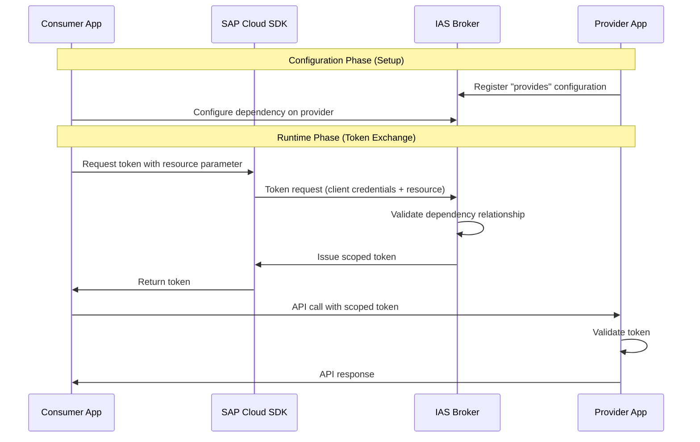

:::warning

IAS App2App is an experimental feature.
Other scenarios such as App2Service are not fully supported yet.
The API may change at any time without prior notice.

:::

The SAP Cloud SDK supports the Identity Authentication Service (IAS) for app-to-app authentication scenarios.
In this scenario, a consumer application requests tokens scoped to specific provider applications through pre-configured dependencies in IAS.

## App2App Authentication

App2App authentication allows secure service-to-service communication where tokens are scoped to specific provider applications.
The consumer and provider applications must have a pre-configured dependency relationship in IAS.

At runtime, the consumer requests a token using the `resource` parameter, which references the provider dependency.
The IAS broker validates the relationship and issues a scoped token that only works for the specified provider.

### Configuration

Provider applications register a "provides" configuration on the IAS broker service, defining which APIs are exposed.
Consumer applications create a service binding to IAS with dependencies on the required provider resources.

The dependency name configured in IAS is used as `resource.name` in the SAP Cloud SDK.



### IasResource

The [`IasResource`](pathname:///api/v4/types/sap-cloud-sdk_connectivity.IasResource.html) type identifies provider dependencies configured in IAS.
It can be specified by dependency name or provider client ID:

```typescript
type IasResource =
  | {
      name: string;
    }
  | {
      clientId: string;
      tenantId?: string;
    };
```

You can specify a single resource or an array of resources for multiple provider dependencies.

Examples:

```typescript
{ name: 'backend-api' }

{ clientId: 'client-123', tenantId: 'tenant-456' }

[{ name: 'backend-api' }, { clientId: 'client-123' }]
```

### IasOptions

The [`IasOptions`](pathname:///api/v4/interfaces/sap-cloud-sdk_connectivity.IasOptions.html) type configures IAS token retrieval:

```typescript
interface IasOptions {
  resource: IasResource | IasResource[];
  targetUrl?: string;
  appTid?: string;
  authenticationType?: 'OAuth2ClientCredentials' | 'OAuth2JWTBearer';
  assertion?: string;
}
```

The `targetUrl` property is required when creating destinations, as IAS service bindings do not include the provider's URL.

### Technical User Authentication

Use [`serviceToken()`](pathname:///api/v4/functions/sap-cloud-sdk_connectivity.serviceToken.html) for service-to-service communication with client credentials:

```typescript
import { serviceToken } from '@sap-cloud-sdk/connectivity';

const token = await serviceToken('my-identity-service', {
  iasOptions: {
    resource: { name: 'backend-api' }
  }
});
```

For multiple provider dependencies, pass an array:

```typescript
const token = await serviceToken('my-identity-service', {
  iasOptions: {
    resource: [{ name: 'backend-api' }, { name: 'payment-service' }]
  }
});
```

In multi-tenant scenarios, specify the consumer tenant ID:

```typescript
const token = await serviceToken('my-identity-service', {
  iasOptions: {
    resource: { name: 'backend-api' },
    appTid: 'consumer-tenant-id'
  }
});
```

### Business User Authentication

Use [`jwtBearerToken()`](pathname:///api/v4/functions/sap-cloud-sdk_connectivity.jwtBearerToken.html) for user context propagation:

```typescript
import { jwtBearerToken } from '@sap-cloud-sdk/connectivity';

const token = await jwtBearerToken(userJwt, 'my-identity-service', {
  iasOptions: {
    resource: { name: 'backend-api' }
  }
});
```

### Creating Destinations

Use [`getDestinationFromServiceBinding()`](pathname:///api/v4/functions/sap-cloud-sdk_connectivity.getDestinationFromServiceBinding.html) to create destinations with IAS authentication.
The `targetUrl` property is required, as IAS service bindings do not include the provider's URL:

```typescript
import { getDestinationFromServiceBinding } from '@sap-cloud-sdk/connectivity';

const destination = await getDestinationFromServiceBinding({
  destinationName: 'my-identity-service',
  iasOptions: {
    targetUrl: 'https://backend-provider.example.com',
    resource: { name: 'backend-api' }
  }
});
```

For business user authentication, provide the JWT and set the authentication type:

```typescript
const destination = await getDestinationFromServiceBinding({
  destinationName: 'my-identity-service',
  jwt: userToken,
  iasOptions: {
    authenticationType: 'OAuth2JWTBearer',
    targetUrl: 'https://backend-provider.example.com',
    resource: { name: 'backend-api' }
  }
});
```

:::note

The destination includes `mtlsKeyPair` with x509 credentials from the IAS service binding, if present.
Use these credentials for mTLS communication with the provider system.

:::
