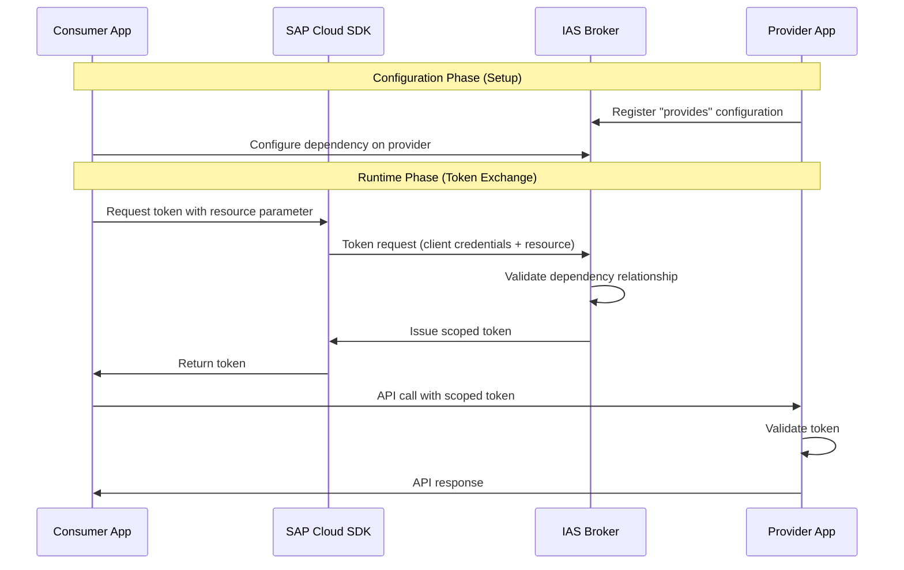

:::warning

Only IAS App2App authentication is supported by the SAP Cloud SDK.
Other scenarios such as App2Service are not fully supported yet.

:::

The SAP Cloud SDK supports the Identity Authentication Service (IAS) for App2App authentication scenarios.
In this scenario, a consumer application requests tokens scoped to specific provider applications through pre-configured dependencies in IAS.

## App2App Authentication

App2App authentication allows secure service-to-service communication where tokens are scoped to specific provider applications.
The consumer and provider applications must have a pre-configured dependency relationship in IAS.

At runtime, the consumer requests a token using the [`resource` parameter](#app2app-resources), which references the provider dependency.
The IAS broker validates the relationship and issues a scoped token that only works for the specified provider.

### Configuration

:::note

The destination includes `mtlsKeyPair` with x509 credentials from the IAS service binding, if present.
The SAP Cloud SDK uses these credentials for mTLS communication with the provider system.

The SAP Cloud SDK supports IAS service bindings with the following credential types:

- **`X509_GENERATED`**: automatically generated X.509 certificates.
- **`SECRET`**: client secret credentials.

:::

Provider applications register a "provides" configuration on the IAS broker service, defining which APIs are exposed.
Consumer applications create a service binding to IAS with dependencies on the required provider resources.

The dependency name configured in IAS is used as `resource.name` in the SAP Cloud SDK.



### Creating Destinations

Use [`getDestinationFromServiceBinding()`](pathname:///api/v4/functions/sap-cloud-sdk_connectivity.getDestinationFromServiceBinding.html) to connect to a system that is registered as an application within IAS.
The parameter `iasOptions` contains:
- `targetUrl`: The URL of the system where the target application resides.
- `resource`: The dependency identified by its name or identifier configured in IAS (see [App2App Resources](#app2app-resources)) section.

#### Technical User Authentication

For service-to-service communication with client credentials:

```typescript
import { getDestinationFromServiceBinding } from '@sap-cloud-sdk/connectivity';

const destination = await getDestinationFromServiceBinding({
  destinationName: 'my-identity-service',
  iasOptions: {
    targetUrl: 'https://backend-provider.example.com',
    resource: { name: 'backend-api' }
  }
});
```

For multi-tenant scenarios, see the [Multi-Tenant Support](#multi-tenant-support) section.

Technical user token requests will be cached by default.
To disable caching, set the `useCache` option to `false` in the destination request:

```typescript
const destination = await getDestinationFromServiceBinding({
  destinationName: 'my-identity-service',
  useCache: false,
  iasOptions: {
    targetUrl: 'https://backend-provider.example.com',
    resource: { name: 'backend-api' }
  }
});
```

#### Business User Authentication

:::warning

When using business user authentication, token requests are not cached.

:::
:::info

Setting `authenticationType` to `OAuth2JWTBearer` is required to trigger Business User authentication.

:::

For user context propagation, provide the JWT and set the authentication type.
When you provide a JWT to the function, it automatically uses it as the assertion for token exchange.
This will happen when no explicit `assertion` is provided in `iasOptions`:

```typescript
const destination = await getDestinationFromServiceBinding({
  destinationName: 'my-identity-service',
  jwt: userToken,
  iasOptions: {
    authenticationType: 'OAuth2JWTBearer',
    targetUrl: 'https://backend-provider.example.com',
    resource: { name: 'backend-api' }
    // assertion is automatically set to userToken
  }
});
```

Multi-tenant scenarios are supported as well, refer to the [JWT-Based Tenant Extraction](#jwt-based-tenant-extraction) section for more details.

### App2App Resources

The [`IasResource`](pathname:///api/v4/types/sap-cloud-sdk_connectivity.IasResource.html) type identifies provider dependencies configured in IAS.
It can be specified by dependency name or provider client identifier:

```typescript
type IasResource =
  | {
      name: string;
    }
  | {
      providerClientId: string;
      providerTenantId?: string;
    };
```

The `name` property refers to the dependency name configured in IAS and is the recommended way to identify resources.
Alternatively, the `providerClientId` property can be used to specify the provider application's client identifier.
Providing `providerClientId` grants access to all dependencies associated with that provider.

### Multi-Tenant Support

In multi-tenant scenarios, you can control the tenant context using the `requestAs` parameter or explicitly provide the tenant identifier.

#### Current Tenant and Provider Tenant options

:::warning

The `requestAs` parameter only affects technical user authentication (client credentials flow).

:::

The `requestAs` parameter determines which tenant (`app_tid`) context is used for the token request:

- **`'current-tenant'`** (default): Uses the tenant from the provided JWT (if any), otherwise falls back to the service binding credentials' `app_tid`
- **`'provider-tenant'`**: Always uses the tenant from the service binding credentials

```typescript
// Request as current tenant (uses JWT's app_tid)
const jwt = '<user-jwt>'; // Placeholder for user JWT
const destination = await getDestinationFromServiceBinding({
  destinationName: 'my-identity-service',
  jwt, // JWT's app_tid will be used
  iasOptions: {
    targetUrl: 'https://backend-provider.example.com',
    resource: { name: 'backend-api' },
    requestAs: 'current-tenant' // default
  }
});
```

```typescript
// Request as provider tenant (uses service binding's app_tid)
const destination = await getDestinationFromServiceBinding({
  destinationName: 'my-identity-service',
  iasOptions: {
    targetUrl: 'https://backend-provider.example.com',
    resource: { name: 'backend-api' },
    requestAs: 'provider-tenant'
  }
});
```

#### Explicit Tenant Identifier

For client credentials flows in multi-tenant scenarios, you can explicitly specify the consumer tenant identifier using `appTid`:

```typescript
const destination = await getDestinationFromServiceBinding({
  destinationName: 'my-identity-service',
  iasOptions: {
    targetUrl: 'https://backend-provider.example.com',
    resource: { name: 'backend-api' },
    appTid: 'subscriber-tenant-id'
  }
});
```

#### JWT-Based Tenant Extraction

When a JWT is supplied in the `options`, the SAP Cloud SDK automatically extracts the tenant information from the JWT assertion and routes token requests to the correct IAS tenant:

```typescript
const destination = await getDestinationFromServiceBinding({
  destinationName: 'my-identity-service',
  jwt: subscriberUserJwt,
  iasOptions: {
    authenticationType: 'OAuth2JWTBearer',
    targetUrl: 'https://backend-provider.example.com',
    resource: { name: 'backend-api' }
  }
});
// Token request is automatically routed to the subscriber's IAS tenant
```
