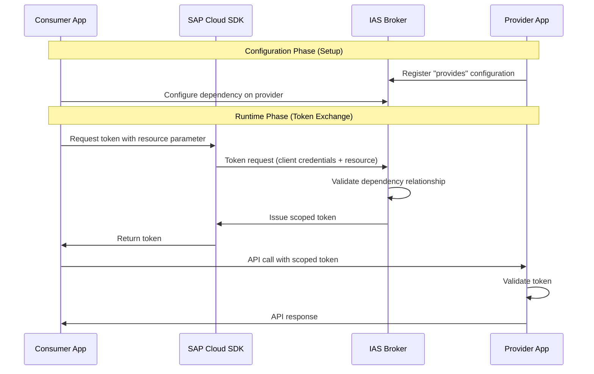

:::warning

IAS App2App is an experimental feature.
Other scenarios such as App2Service are not fully supported yet.
The API may change at any time without prior notice.

:::

The SAP Cloud SDK supports the Identity Authentication Service (IAS) for app-to-app authentication scenarios.
In this scenario, a consumer application requests tokens scoped to specific provider applications through pre-configured dependencies in IAS.

## App2App Authentication

App2App authentication allows secure service-to-service communication where tokens are scoped to specific provider applications.
The consumer and provider applications must have a pre-configured dependency relationship in IAS.

At runtime, the consumer requests a token using the `resource` parameter, which references the provider dependency.
The IAS broker validates the relationship and issues a scoped token that only works for the specified provider.

### Configuration

Provider applications register a "provides" configuration on the IAS broker service, defining which APIs are exposed.
Consumer applications create a service binding to IAS with dependencies on the required provider resources.

The dependency name configured in IAS is used as `resource.name` in the SAP Cloud SDK.



### IasResource

The [`IasResource`](pathname:///api/v4/types/sap-cloud-sdk_connectivity.IasResource.html) type identifies provider dependencies configured in IAS.
It can be specified by dependency name or provider client ID:

```typescript
type IasResource =
  | {
      name: string;
    }
  | {
      providerClientId: string;
      providerTenantId?: string;
    };
```

The `name` property refers to the dependency name configured in IAS, and is the recommended way to identify resources.
Alternatively, the `providerClientId` property can be used to specify the provider application's client ID.
This may be necessary if there are multiple dependencies on the same provider application with different permissions, providing `providerClientId` will grant access to all dependencies associated with that provider.
The `providerTenantId` property is optional and can be used in multi-tenant scenarios to specify the provider tenant.

### IasOptions

The [`IasOptions`](pathname:///api/v4/interfaces/sap-cloud-sdk_connectivity.IasOptions.html) type configures IAS token retrieval.
It uses a type-safe union to enforce the relationship between `authenticationType` and `assertion`:

```typescript
// For technical user authentication (default)
interface IasOptionsTechnical {
  resource?: IasResource;
  targetUrl?: string;
  appTid?: string;
  authenticationType?: 'OAuth2ClientCredentials';
  extraParams?: Record<string, string>;
}

// For business user authentication
interface IasOptionsBusinessUser {
  resource?: IasResource;
  targetUrl?: string;
  appTid?: string;
  authenticationType: 'OAuth2JWTBearer';
  assertion: string; // Required for user authentication
  extraParams?: Record<string, string>;
}

type IasOptions = IasOptionsTechnical | IasOptionsBusinessUser;
```

The `targetUrl` property is required when creating destinations, as service bindings for the identity service broker do not include the service provider's URL.
If `OAuth2JWTBearer` is used as `authenticationType`, the `assertion` property must contain the user JWT for token exchange.
The `extraParams` property allows you to pass additional OAuth2 parameters with the token request.

### Technical User Authentication

Use [`serviceToken()`](pathname:///api/v4/functions/sap-cloud-sdk_connectivity.serviceToken.html) for service-to-service communication with client credentials:

```typescript
import { serviceToken } from '@sap-cloud-sdk/connectivity';

const token = await serviceToken('my-identity-service', {
  iasOptions: {
    resource: { name: 'backend-api' }
  }
});
```

In multi-tenant scenarios, you may have to specify the consumer tenant ID:

```typescript
const token = await serviceToken('my-identity-service', {
  iasOptions: {
    resource: { name: 'backend-api' },
    appTid: 'consumer-tenant-id'
  }
});
```

### Business User Authentication

Use [`jwtBearerToken()`](pathname:///api/v4/functions/sap-cloud-sdk_connectivity.jwtBearerToken.html) for user context propagation.
The `appTid` option is derived from the provided user JWT:

```typescript
import { jwtBearerToken } from '@sap-cloud-sdk/connectivity';

const token = await jwtBearerToken(userJwt, 'my-identity-service', {
  iasOptions: {
    resource: { name: 'backend-api' }
  }
});
```

### Creating Destinations

Use [`getDestinationFromServiceBinding()`](pathname:///api/v4/functions/sap-cloud-sdk_connectivity.getDestinationFromServiceBinding.html) to create destinations with IAS authentication.
The `targetUrl` property is required when creating destinations, as service bindings for the identity service broker do not include the service provider's URL.

```typescript
import { getDestinationFromServiceBinding } from '@sap-cloud-sdk/connectivity';

const destination = await getDestinationFromServiceBinding({
  destinationName: 'my-identity-service',
  iasOptions: {
    targetUrl: 'https://backend-provider.example.com',
    resource: { name: 'backend-api' }
  }
});
```

For business user authentication, provide the JWT and set the authentication type.
When you provide a JWT to the function, it automatically uses it as the assertion for token exchange if no explicit `assertion` is provided in `iasOptions`:

```typescript
const destination = await getDestinationFromServiceBinding({
  destinationName: 'my-identity-service',
  jwt: userToken,
  iasOptions: {
    authenticationType: 'OAuth2JWTBearer',
    targetUrl: 'https://backend-provider.example.com',
    resource: { name: 'backend-api' }
    // assertion is automatically set to userToken
  }
});
```

:::note

The destination includes `mtlsKeyPair` with x509 credentials from the IAS service binding, if present.
These credentials will be used for mTLS communication with the provider system.

:::

### Multi-Tenant Subscriber Routing

In multi-tenant scenarios, the SAP Cloud SDK automatically handles routing to the correct IAS tenant based on the JWT assertion.
When using JWT bearer authentication (`OAuth2JWTBearer`), the SAP Cloud SDK extracts the subdomain from the JWT issuer and creates a tenant-specific IAS service instance.

This ensures that token requests are routed to the subscriber's IAS tenant, not the provider's tenant.
The SAP Cloud SDK validates the issuer URL from the JWT and adjusts the IAS service URL accordingly while maintaining security by not fully delegating trust to the JWT assertion.

```typescript
// The SAP Cloud SDK automatically extracts the subscriber tenant from the JWT
const token = await jwtBearerToken(subscriberUserJwt, 'my-identity-service', {
  iasOptions: {
    resource: { name: 'backend-api' }
  }
});
// Token request is automatically routed to the subscriber's IAS tenant
```

For client credentials flows in multi-tenant scenarios, you can explicitly specify the tenant:

```typescript
const token = await serviceToken('my-identity-service', {
  iasOptions: {
    resource: { name: 'backend-api' },
    appTid: 'subscriber-tenant-id'
  }
});
```

### Token Caching

IAS tokens are cached automatically to improve performance and reduce load on the IAS broker.
The cache is resource-aware, meaning tokens for different provider dependencies are cached separately.
In multi-tenant scenarios, tokens are also cached per tenant subdomain.

```typescript
const token1 = await serviceToken('my-identity-service', {
  iasOptions: { resource: { name: 'backend-api' } }
});

const token2 = await serviceToken('my-identity-service', {
  iasOptions: { resource: { name: 'backend-api' } }
});
```

In the example above, the second call returns the cached token from the first call.
A call with a different resource would fetch a new token from the IAS broker.

Tokens are cached until they expire.
To bypass the cache, set `useCache: false` in the options.
