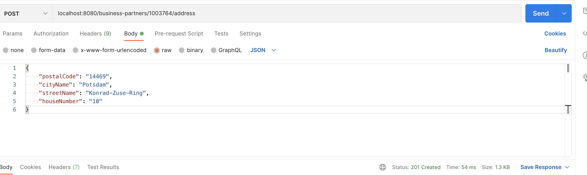

import Tabs from '@theme/Tabs';
import TabItem from '@theme/TabItem';

## Overview

In the [first part](./read-addresses.mdx) of the tutorial, you implemented the read operation on business partners and the related address information.
In this part you will learn:

- How to create a new address.
- How to update an existing address.
- How to delete an existing address.

## Create an Address

After reading the data in the first part of the tutorial, it is now time to change the data.
You will use the `businessPartnerAddressApi` to adjust the addresses.
You start with the creation of new addresses.
Add a service implementation in the `business-partner.service.ts`:

```ts
  createAddress(
    address: Record<string, any>,
    businessPartnerId: string
  ): Promise<BusinessPartnerAddress> {
    const businessPartnerAddress = businessPartnerAddressApi
      .entityBuilder()
      .fromJson({ businessPartner: businessPartnerId, ...address });
    return businessPartnerAddressApi
      .requestBuilder()
      .create(businessPartnerAddress)
      .execute({ url: "http://localhost:3000" });
  }
```

Use the entity builder to create a new address object from the input.
The business partner ID is added to the address object.
This is mandatory to define for which business partner the address is created.
Use the request builder to build a create request and execute it against the mock server.

You need to adjust the `business-partner.controller.ts` to expose the new service.
Since you want to create data, a `POST` request is needed:

```ts
  @Post("/:businessPartnerId/address")
  @HttpCode(201)
  createAddress(
    @Body() requestBody: Record<string, any>,
    @Param("businessPartnerId") businessPartnerId: string
  ): Promise<BusinessPartnerAddress> {
    return this.businessPartnerService.createAddress(requestBody, businessPartnerId);
  }
```

The ID of the business partner is taken from the URL of the request and the new address from the body.

### Test Create Service

To test the new service, you need an HTTP client like [postman](https://learning.postman.com/docs/getting-started/installation-and-updates/) to create a `POST` request.
Create a new request with the following parameters:

```
POST http://localhost:8080/business-partner/1003764/address
BODY
{
    "postalCode": "14469",
    "cityName": "Potsdam",
    "streetName": "Konrad-Zuse-Ring",
    "houseNumber": "10"
}
```

You find the ID of a business partner via the endpoint `http://localhost:8080/business-partner`.
The request should return `201` as a [status code](https://developer.mozilla.org/en-US/docs/Web/HTTP/Status#successful_responses).



If you execute `GET http://localhost:8080/business-partner/1003764` afterward, you should see the additional address for the business partner.

## Update Service

As a next step, we would like to update existing addresses.
This is done using the `update` request builder.
Add the following code in the `business-partner.service.ts`:

```ts
  updateAddress(
    address: Record<string, any>,
    businessPartnerId: string,
    addressId: string
  ): Promise<BusinessPartnerAddress> {
    const businessPartnerAddress = businessPartnerAddressApi
      .entityBuilder()
      .fromJson({ businessPartner:businessPartnerId, addressId, ...address });
    return businessPartnerAddressApi
      .requestBuilder()
      .update(businessPartnerAddress)
      .execute({ url: "http://localhost:3000" });
  }
```

First, an address object is built from the user input.
It contains the ID of the business partner and the address to be updated.
This is necessary because a business partner can contain multiple addresses.

Expose the service implementation via the `business-partner.controller.ts`:

```ts
  @Put('/:businessPartnerId/address/:addressId')
  updateBusinessPartnerAddress(
    @Body() requestBody: Record<string, any>,
    @Param('businessPartnerId') businessPartnerId: string,
    @Param('addressId') addressId: string
  ): Promise<BusinessPartnerAddress> {
    return this.businessPartnerService.updateAddress(requestBody,businessPartnerId,addressId);
  }
```

The path of the service contains the ID of the business partner and the address to be updated.
The new address is given in the payload.

### Test Update Service

The update request is triggered by the `PUT` method.
Execute the update request in your HTTP client (e.g. [postman](https://learning.postman.com/docs/getting-started/installation-and-updates/)):

```
PUT http://localhost:8080/business-partner/1003764/address/28238
BODY
{
    "houseNumber": "123"
}
```

After the update, a `GET http://localhost:8080/business-partner/1003764` should show the updated house number 123.

## Delete Address

After creating and updating addresses, it is time to delete an address.
Also here you start with the service implementation in `business-partner.service.ts`:

```ts
  deleteAddress(businessPartnerId: string, addressId: string): Promise<void> {
    return businessPartnerAddressApi
      .requestBuilder()
      .delete(businessPartnerId, addressId)
      .execute({ url: "http://localhost:3000" });
  }
```

As for the other operations, the `requestBuilder` is used to build the `delete` request.
The method needs the two IDs to identify the business partner and address you want to delete.

The delete endpoint is exposed in the `business-partner.controller.ts` via the following code:

```ts
  @Delete("/:businessPartnerId/address/:addressId")
  @HttpCode(204)
  deleteBusinessPartnerAddress(
    @Param("businessPartnerId") businessPartnerId: string,
    @Param("addressId") addressId: string
  ): Promise<void> {
    return this.businessPartnerService.deleteAddress(
      businessPartnerId,
      addressId
    );
  }
```

You use the HTTP method `DELETE` to trigger a deletion and the status 204 indicates a successful deletion.

### Test Delete Service

You can test the service in the following way.
Execute `GET http://localhost:8080/business-partner/1003764` and note the ID of an address you want to delete e.g. 28241.
Then execute `DELETE http://localhost:8080/business-partner/1003764/address/28241` in your HTTP client.
This should return 204 if existing IDs are passed.
To verify you can execute `GET http://localhost:8080/business-partner/1003764` afterward and the selected address should be removed.

## Final Code Review

In this tutorial, you learned how to create, update and delete addresses using the SAP Cloud SDK.
First, an implementation is added in the service class.
Then the implementation is exposed in the controller class.
The result of this and the [previous tutorial](./read-addresses.mdx) is an API to manage business partner addresses.

You can find the complete code below:

<Tabs groupId="code-files" defaultValue="business-partner.service.ts" values={[{ label: 'business-partner.service.ts', value: 'business-partner.service.ts' }, { label: 'business-partner.controller.ts', value: 'business-partner.controller.ts' }]}>

<TabItem value="business-partner.service.ts" className="code-block-height-js thin-scrollbar">

```ts
import { Injectable } from '@nestjs/common';
import {
  BusinessPartner,
  BusinessPartnerAddress,
  businessPartnerService
} from '../../services/business-partner-service';
import * as dotenv from 'dotenv';

dotenv.config();
const { businessPartnerApi, businessPartnerAddressApi } =
  businessPartnerService();

/**
 * Service implementation of address API.
 */
@Injectable()
export class BusinessPartnerService {
  /**
   * Gets a list of all business partners.
   * @returns List of business partners.
   */
  async getAllBusinessPartners(): Promise<BusinessPartner[]> {
    return businessPartnerApi
      .requestBuilder()
      .getAll()
      .select(
        businessPartnerApi.schema.BUSINESS_PARTNER,
        businessPartnerApi.schema.FIRST_NAME,
        businessPartnerApi.schema.LAST_NAME,
        businessPartnerApi.schema.TO_BUSINESS_PARTNER_ADDRESS.select(
          businessPartnerAddressApi.schema.BUSINESS_PARTNER,
          businessPartnerAddressApi.schema.ADDRESS_ID
        )
      )
      .filter(businessPartnerApi.schema.BUSINESS_PARTNER_CATEGORY.equals('1'))
      .execute({ url: 'http://localhost:3000' });
  }

  /**
   * Get a business partner by ID.
   * @param id - ID of the business partner to be returned.
   * @returns The business partner with the given ID.
   */
  getBusinessPartnerById(id: string): Promise<BusinessPartner> {
    return businessPartnerApi
      .requestBuilder()
      .getByKey(id)
      .select(
        businessPartnerApi.schema.BUSINESS_PARTNER,
        businessPartnerApi.schema.FIRST_NAME,
        businessPartnerApi.schema.LAST_NAME,
        businessPartnerApi.schema.TO_BUSINESS_PARTNER_ADDRESS.select(
          businessPartnerAddressApi.schema.BUSINESS_PARTNER,
          businessPartnerAddressApi.schema.ADDRESS_ID,
          businessPartnerAddressApi.schema.POSTAL_CODE,
          businessPartnerAddressApi.schema.CITY_NAME,
          businessPartnerAddressApi.schema.STREET_NAME,
          businessPartnerAddressApi.schema.HOUSE_NUMBER
        )
      )
      .execute({ url: 'http://localhost:3000' });
  }

  /**
   * Creates an address for a business partner.
   * @param address - Address which is added to the business partner.
   * @param id - ID of the business partner.
   * @returns The address which was created.
   */
  public createAddress(
    address: Record<string, any>,
    id: string
  ): Promise<BusinessPartnerAddress> {
    const businessPartnerAddress = businessPartnerAddressApi
      .entityBuilder()
      .fromJson({ businessPartner: id, ...address });

    return businessPartnerAddressApi
      .requestBuilder()
      .create(businessPartnerAddress)
      .execute({ url: 'http://localhost:3000' });
  }

  /**
   * Updates an address of a business partner.
   * @param address - New address information after update. Existing values are overwritten, new ones are added.
   * @param businessPartner - ID of business partner whose address is updated.
   * @param addressId - ID of address which is updated.
   * @returns - The address after update.
   */
  updateAddress(
    address: Record<string, any>,
    businessPartner: string,
    addressId: string
  ): Promise<BusinessPartnerAddress> {
    const businessPartnerAddress = businessPartnerAddressApi
      .entityBuilder()
      .fromJson({ businessPartner, addressId, ...address });

    return businessPartnerAddressApi
      .requestBuilder()
      .update(businessPartnerAddress)
      .execute({ url: 'http://localhost:3000' });
  }

  /**
   * Deletes an address of a business partner.
   * @param businessPartner - ID of the business partner to be updated.
   * @param addressId - ID of address to be deleted.
   * @returns - Void.
   */
  deleteAddress(businessPartner: string, addressId: string): Promise<void> {
    return businessPartnerAddressApi
      .requestBuilder()
      .delete(businessPartner, addressId)
      .execute({ url: 'http://localhost:3000' });
  }
}
```

</TabItem>
<TabItem value="business-partner.controller.ts" className="code-block-height-js thin-scrollbar">

```ts
import {
  Body,
  Controller,
  Delete,
  Get,
  HttpCode,
  Param,
  Post,
  Put
} from '@nestjs/common';
import {
  BusinessPartner,
  BusinessPartnerAddress
} from '../../services/business-partner-service';
import { BusinessPartnerService } from './business-partner.service';

@Controller('business-partner')
export class BusinessPartnerController {
  constructor(
    private readonly businessPartnerService: BusinessPartnerService
  ) {}

  @Get()
  getAllBusinessPartners(): Promise<BusinessPartner[]> {
    return this.businessPartnerService.getAllBusinessPartners();
  }

  @Get('/:id')
  getBusinessPartnerById(@Param('id') id: string): Promise<BusinessPartner> {
    return this.businessPartnerService.getBusinessPartnerById(id);
  }

  @Post('/:id/address')
  @HttpCode(201)
  createAddress(
    @Body() requestBody: Record<string, any>,
    @Param('id') id: string
  ): Promise<BusinessPartnerAddress> {
    return this.businessPartnerService.createAddress(requestBody, id);
  }

  @Put('/:businessPartnerId/address/:addressId')
  updateBusinessPartnerAddress(
    @Body() requestBody: Record<string, any>,
    @Param('businessPartnerId') businessPartnerId: string,
    @Param('addressId') addressId: string
  ): Promise<BusinessPartnerAddress> {
    return this.businessPartnerService.updateAddress(
      requestBody,
      businessPartnerId,
      addressId
    );
  }

  @Delete('/:businessPartnerId/address/:addressId')
  @HttpCode(204)
  deleteBusinessPartnerAddress(
    @Param('businessPartnerId') businessPartnerId: string,
    @Param('addressId') addressId: string
  ): Promise<void> {
    return this.businessPartnerService.deleteAddress(
      businessPartnerId,
      addressId
    );
  }
}
```

</TabItem>
</Tabs>
