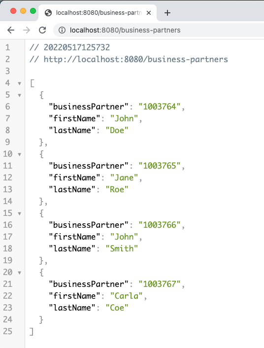

import Tabs from '@theme/Tabs';
import TabItem from '@theme/TabItem';

## Overview

In the SAP S/4HANA data model, addresses are related to the business partner entity.
Each business partner can have multiple addresses assigned.
You will develop an application that provides a REST API to manage the addresses of business partners.
In this part of the tutorial, you will create the endpoints reading data.
You will learn:

- How to retrieve a single business partner.
- How to retrieve the addresses of a business partner.

The tutorial is based on the initial NestJs application explained in the [first part of the getting started tutorials](../getting-started/1-set-up-dev-environment.mdx).
In that tutorial you already created [a first OData request](../getting-started/2-execute-odata-request.mdx) to get a list of business partners.
You will extend the functionality of the API in this tutorial and the [follow-up part](./change-addresses.mdx).
Since the follow-up part is about changing data, use a [local mock system](https://sap.github.io/cloud-s4-sdk-book/pages/mock-odata.html).
Changing data is impossible on SAP API Business Hub and an actual SAP S/4HANA instance should not be polluted with test data.
Note that both systems run locally but have different ports:

- `localhost:3000` is the mock system imitating the SAP S/4HANA system.
- `localhost:8080` is the address manager application you develop in the tutorial.

## Get All Business Partners

### Recap Existing Service

In the previous [tutorial](../getting-started/2-execute-odata-request.mdx), you created an OData request to retrieve business partners.
You included the following code in your `business-partner.service.ts`

```ts
import { Injectable } from '@nestjs/common';
import {
  BusinessPartner,
  businessPartnerService
} from '../../services/business-partner-service';

@Injectable()
export class BusinessPartnerService {
  getAllBusinessPartners(): Promise<BusinessPartner[]> {
    const { businessPartnerApi } = businessPartnerService();
    return businessPartnerApi
      .requestBuilder()
      .getAll()
      .addCustomHeaders({ apikey: process.env.APIKey })
      .execute({ url: 'http://localhost:3000' });
  }
}
```

Let's walk you through the implementation of the service as a recap.
You have imported the `businessPartnerService` which offers you many APIs and you picked the `businessPartnerApi`.
With this API you requested all business partners using the `getAll` request builder.
As discussed, you should use the local [mock system](https://sap.github.io/cloud-s4-sdk-book/pages/mock-odata.html).
For simplicity, the `url` is passed directly to the `execute()` method.

:::caution

In real applications, you would use a real SAP S/4HANA system and the [destination service](../../features/connectivity/destination.mdx) to avoid leaking private or secret information through hard-coding system properties.

:::

### Test GetAll Service

You can start your application using:

```Shell
npm start
```

When the server is running, you should see a message like: `[NestApplication] Nest application successfully started` and some mappings related to the listed controllers.
Open the URL `http://localhost:8080/business-partner` and you should see the data of the mock server.

### Select Certain Fields

The output from the previous sections shows all fields of the business partner entity.
Like SQL, OData allows the selection of only specific properties of an entity.
For the address manager only the ID, first name, and last name of a business partner are needed.
Add a `select` statement to the service implementation:

```ts
const { businessPartnerApi } = businessPartnerService();

@Injectable()
export class BusinessPartnerService {
  getAllBusinessPartners(): Promise<BusinessPartner[]> {
    return businessPartnerApi
      .requestBuilder()
      .getAll()
      .select(
        businessPartnerApi.schema.BUSINESS_PARTNER,
        businessPartnerApi.schema.FIRST_NAME,
        businessPartnerApi.schema.LAST_NAME
      )
      .top(10)
      .execute({ url: 'http://localhost:3000' });
  }
}
```

As you can see, each property you select is represented by a property of the `businessPartnerApi` schema.
To keep the code shorter, the `businessPartnerApi` has been assigned to a local variable.
If your IDE supports code completion, you can see all properties that can be selected on this entity by typing `businessPartnerApi.schema.`.
Depending on your IDE, the list may show automatically or when you trigger the code completion manually (often by pressing `Ctrl` + `Space`).
This saves you from having to look up the properties in the metadata and prevents errors due to mistyping.

If you open the URL `http://localhost:8080/business-partner`, you should see only the ID, first name, and last name of the business partners.



### Filter Business Partners by Type

Business partners can either be natural persons or legal persons (e.g. organizations or companies).
For the address manager, only addresses of natural persons are relevant.
Therefore, you need to filter your request.
Modify your code like this:

```ts
businessPartnerApi
      .requestBuilder()
      .getAll()
      .select(
        businessPartnerApi.schema.BUSINESS_PARTNER,
        businessPartnerApi.schema.FIRST_NAME,
        businessPartnerApi.schema.LAST_NAME
      )
      .filter(
          businessPartnerApi.schema.BUSINESS_PARTNER_CATEGORY.equals('1')
      )
      .execute({ url: "http://localhost:3000" });
}
```

As for the `select()` method, you can use the properties of the `BusinessPartner` entity directly for filtering.
Each property offers a set of methods for constructing filters.
Every property has a `equals()` and `notEquals()` method.
Depending on the type of property, there can be additional methods like `greaterThan()` or `greaterOrEqual()`.

Since the type of the property is known, the typed client will prevent you from passing values of the wrong type.
For example, `businessPartnerApi.schema.FIRST_NAME.equals(1)` would not compile when using TypeScript.
In JavaScript, the code would only fail at run-time, but your editor may raise a warning for the type mismatch.

For more complicated filter conditions have a look at the [filter documentation](../../features/odata/odata-v2-client.mdx#filter).

## Get Addresses of Business Partner

As a first step, you created an endpoint for obtaining a list of business partners.
In this part of the tutorial, you will create the services to read the addresses.

### Get One Business Partner

The address manager shows the addresses related to one business partner.
Create a query for fetching one specific business partner.
Each business partner has a unique ID, which you can use to do that.
Include a second method in the existing `business-partner.service.ts`

```ts
getBusinessPartnerById(id: string): Promise<BusinessPartner> {
    return businessPartnerApi
      .requestBuilder()
      .getByKey(id)
      .execute({ url: 'http://localhost:3000' });
}
```

As before, you call `businessPartnerApi.requestBuilder()` to select the type of request you want to build.
Since you only want to get a single business partner, you use the `getByKey()` function and then call `execute()` to execute the request.
Again, you use the local mock server from the previous section for the `getAll()` request.

As a next step, you need to expose the service via the controller.
Open the `business-partner.controller.ts` and add the following method:

```ts
@Get('/:id')
getBusinessPartnerById(@Param('id') id: string): Promise<BusinessPartner> {
    return this.businessPartnerService.getBusinessPartnerById(id);
}
```

The method takes the ID from the URL and passes it to `getBusinessPartnerById()` in the service class.
If a business partner with the provided ID exists in the target system, it will be sent to the client.
Otherwise, an error message is sent.

### Test GetById Service

Restart your server and open `http://localhost:8080/business-partner` to get the list of all business partners.
Copy one ID from the result list and execute `http://localhost:8080/business-partner/<yourId>`.
You should see the details of the chosen business partner.
Note that Nest applications have a built-in [exception filter](https://docs.nestjs.com/exception-filters), which maps exceptions to HTTP messages shown to the client.
By default, the exceptions from the SAP Cloud SDK are mapped to a server-side error.
So if you provide a non-existing ID, you will receive a 500 response and not a 404.

### Navigate To Address

As mentioned before, the address is a separate OData entity related to the business partner.
In OData, the address is a navigation property of the business partner.
If you want to include such a related property in the query result, you have to include it in the select statement:

```ts
return businessPartnerApi
  .requestBuilder()
  .getByKey(id)
  .select(
    businessPartnerApi.schema.BUSINESS_PARTNER,
    businessPartnerApi.schema.FIRST_NAME,
    businessPartnerApi.schema.LAST_NAME,
    businessPartnerApi.schema.TO_BUSINESS_PARTNER_ADDRESS
  )
  .execute({ url: 'http://localhost:3000' });
```

This implicitly expands the property and includes all properties like street, house number, and state of the address in the result.
Also here only some properties of the address are relevant.
A second select on the navigation property reduces the response to the desired fields:

```ts
const { businessPartnerAddressApi } = businessPartnerService();

return businessPartnerApi
  .requestBuilder()
  .getByKey(id)
  .addCustomHeaders({ apikey: process.env.APIKey })
  .select(
    businessPartnerApi.schema.BUSINESS_PARTNER,
    businessPartnerApi.schema.FIRST_NAME,
    businessPartnerApi.schema.LAST_NAME,
    businessPartnerApi.schema.TO_BUSINESS_PARTNER_ADDRESS.select(
      businessPartnerAddressApi.schema.BUSINESS_PARTNER,
      businessPartnerAddressApi.schema.ADDRESS_ID
      businessPartnerAddressApi.schema.POSTAL_CODE,
      businessPartnerAddressApi.schema.CITY_NAME,
      businessPartnerAddressApi.schema.STREET_NAME,
      businessPartnerAddressApi.schema.HOUSE_NUMBER
    )
  )
  .execute({ url: 'http://localhost:3000' });
```

Properties like `POSTAL_CODE` and `CITY_NAME` are part of the address API and related schema.
The `businessPartnerAddressApi` is also part of the business partner service.
If you call the URL `http://localhost:8080/business-partner/YOUR_ID`, the service returns a single business partner with the selected address information:

```json
{
  "businessPartner": "1003765",
  "firstName": "Jane",
  "lastName": "Roe",
  "toBusinessPartnerAddress": [
    {
      "businessPartner": "1003765",
      "addressId": "28241",
      "cityName": "Palo Alto",
      "houseNumber": "3410",
      "postalCode": "CA 94304",
      "streetName": "Hillview Avenue"
    }
  ]
}
```

## Final Code Review

In this tutorial, you have created an API to read business partners.
You created endpoints to read a list of business partners as well as a specific business partner by ID.
You adjusted the results with `select()` and `filter()` statements to fit your needs.
In the [next part](./change-addresses.mdx) you will extend the API to change data.

You can find the complete code below:

<Tabs groupId="code-files" defaultValue="business-partner.service.ts" values={[{ label: 'business-partner.service.ts', value: 'business-partner.service.ts'}, { label: 'business-partner.controller.ts', value: 'business-partner.controller.ts'}]}>

<TabItem value="business-partner.service.ts" className="code-block-height-js thin-scrollbar">

```ts
import { Injectable } from '@nestjs/common';
import {
  BusinessPartner,
  BusinessPartnerAddress,
  businessPartnerService
} from '../../services/business-partner-service';
import * as dotenv from 'dotenv';

dotenv.config();
const { businessPartnerApi, businessPartnerAddressApi } =
  businessPartnerService();

/**
 * Service implementation of address API.
 */
@Injectable()
export class BusinessPartnerService {
  /**
   * Gets a list of all business partners.
   * @returns List of business partner.
   */
  async getAllBusinessPartners(): Promise<BusinessPartner[]> {
    return businessPartnerApi
      .requestBuilder()
      .getAll()
      .select(
        businessPartnerApi.schema.BUSINESS_PARTNER,
        businessPartnerApi.schema.FIRST_NAME,
        businessPartnerApi.schema.LAST_NAME,
        businessPartnerApi.schema.TO_BUSINESS_PARTNER_ADDRESS.select(
          businessPartnerAddressApi.schema.BUSINESS_PARTNER,
          businessPartnerAddressApi.schema.ADDRESS_ID
        )
      )
      .filter(businessPartnerApi.schema.BUSINESS_PARTNER_CATEGORY.equals('1'))
      .execute({ url: 'http://localhost:3000' });
  }

  /**
   * Get a business partner by ID.
   * @param id - ID of the business partner to be returned.
   * @returns The business partner with the given ID.
   */
  getBusinessPartnerById(id: string): Promise<BusinessPartner> {
    return businessPartnerApi
      .requestBuilder()
      .getByKey(id)
      .select(
        businessPartnerApi.schema.BUSINESS_PARTNER,
        businessPartnerApi.schema.FIRST_NAME,
        businessPartnerApi.schema.LAST_NAME,
        businessPartnerApi.schema.TO_BUSINESS_PARTNER_ADDRESS.select(
          businessPartnerAddressApi.schema.BUSINESS_PARTNER,
          businessPartnerAddressApi.schema.ADDRESS_ID,
          businessPartnerAddressApi.schema.POSTAL_CODE,
          businessPartnerAddressApi.schema.CITY_NAME,
          businessPartnerAddressApi.schema.STREET_NAME,
          businessPartnerAddressApi.schema.HOUSE_NUMBER
        )
      )
      .execute({ url: 'http://localhost:3000' });
  }
}
```

</TabItem>

<TabItem value="business-partner.controller.ts" className="code-block-height-js thin-scrollbar">

```ts
import {
  Body,
  Controller,
  Delete,
  Get,
  HttpCode,
  Param,
  Post,
  Put
} from '@nestjs/common';
import {
  BusinessPartner,
  BusinessPartnerAddress
} from '../../services/business-partner-service';
import { BusinessPartnerService } from './business-partner.service';

@Controller('business-partner')
export class BusinessPartnerController {
  constructor(
    private readonly businessPartnerService: BusinessPartnerService
  ) {}

  @Get()
  getAllBusinessPartners(): Promise<BusinessPartner[]> {
    return this.businessPartnerService.getAllBusinessPartners();
  }

  @Get('/:id')
  getBusinessPartnerById(@Param('id') id: string): Promise<BusinessPartner> {
    return this.businessPartnerService.getBusinessPartnerById(id);
  }

  @Post('/:id/address')
  @HttpCode(201)
  createAddress(
    @Body() requestBody: Record<string, any>,
    @Param('id') id: string
  ): Promise<BusinessPartnerAddress> {
    return this.businessPartnerService.createAddress(requestBody, id);
  }

  @Put('/:businessPartnerId/address/:addressId')
  updateBusinessPartnerAddress(
    @Body() requestBody: Record<string, any>,
    @Param('businessPartnerId') businessPartnerId: string,
    @Param('addressId') addressId: string
  ): Promise<BusinessPartnerAddress> {
    return this.businessPartnerService.updateAddress(
      requestBody,
      businessPartnerId,
      addressId
    );
  }

  @Delete('/:businessPartnerId/address/:addressId')
  @HttpCode(204)
  deleteBusinessPartnerAddress(
    @Param('businessPartnerId') businessPartnerId: string,
    @Param('addressId') addressId: string
  ): Promise<void> {
    return this.businessPartnerService.deleteAddress(
      businessPartnerId,
      addressId
    );
  }
}
```

</TabItem>
</Tabs>
