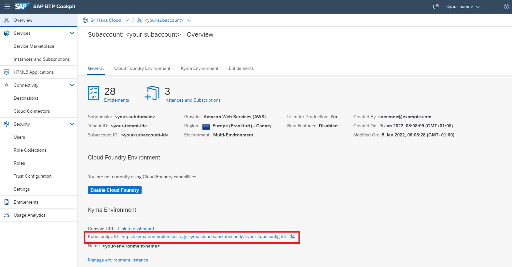
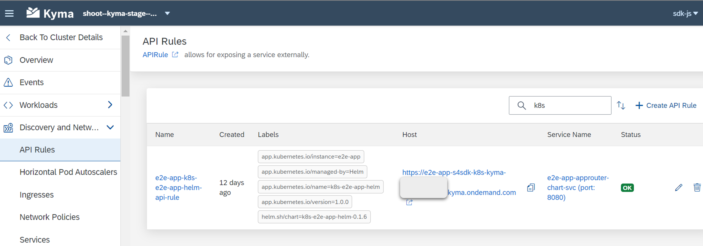

import {
  DockerFile,
  KymaApprouterTabs,
  KymaAppTabs,
  OperatorDestinationService,
  OperatorXsuaaService,
  KubernetesTransparentProxy
} from './code';

[Kyma](https://kyma-project.io/docs/kyma/latest/01-overview/) is an open source project, that offers a comprehensive suite of tools and services, specifically created for the development and operation of cloud-native applications seamlessly integrated with Kubernetes.

# Getting Started with the SAP Cloud SDK on Kyma

This guide helps you migrate your existing application, built with the SAP Cloud SDK for JavaScript, to Kyma.
The reference application we will use in this guide can be found in the [samples repository](https://github.com/SAP-samples/cloud-sdk-js/tree/main/samples/helm-sample-application).
We will also deploy an approuter so that only authenticated users can access the application.

### Prerequisites

- Install [`docker`](https://docs.docker.com/get-docker/) and ensure access to a publicly reachable Docker repository.
  :::info
  A Kubernetes cluster uses a secret to authenticate with a container registry to pull an image.
  For that, you will need to [configure a secret in your cluster](https://kubernetes.io/docs/tasks/configure-pod-container/pull-image-private-registry/#create-a-secret-by-providing-credentials-on-the-command-line):

  ```bash
  kubectl create secret docker-registry regcred --docker-server=YOUR_DOCKER_SERVER --docker-username=YOUR_DOCKER_USERNAME --docker-password=YOUR_DOCKER_PASSWORD --docker-email=YOUR_DOCKER_EMAIL
  ```

  :::

- An SAP BTP Kyma instance created in your subaccount
  <!-- vale off -->

  :::info
  If you do not have an existing Kyma instance, follow the [documentation](https://help.sap.com/docs/btp/sap-business-technology-platform/create-kyma-environment-instance) to create one.
  Once your Kyma environment is created, download the [Kubeconfig](https://kubernetes.io/docs/concepts/configuration/organize-cluster-access-kubeconfig/) file directly from the SAP BTP cockpit.
  
  :::
  <!-- vale on -->

- [`kubectl`](https://kubernetes.io/docs/tasks/tools/) configured to work with your SAP BTP, Kyma runtime instance
- [`helm`](https://helm.sh/docs/intro/install/), a package manager for Kubernetes
  :::info
  This guide assumes you have installed the [Helm](https://helm.sh/docs/intro/install/) client and know how to configure and use [Helm Charts](https://helm.sh/docs/topics/charts/).

  If you are using the [example application](https://github.com/SAP-samples/cloud-sdk-js/tree/main/samples/helm-sample-application/application) from the SAP Cloud SDK Samples repository, you can use the existing [Helm package](https://github.com/SAP-samples/cloud-sdk-js/blob/main/samples/helm-sample-application/helm-chart/k8s-e2e-app-helm-0.1.5.tgz) and don't need to create all the files again.
  Otherwise, use the code snippets given in this guide as reference and adjust the values according to your application.
  :::

- A Node.js application using the SAP Cloud SDK and an approuter
  :::info
  If you do not have an application yet, you can use the [example application](https://github.com/SAP-samples/cloud-sdk-js/tree/main/samples/helm-sample-application/application) and [approuter](https://github.com/SAP-samples/cloud-sdk-js/tree/main/samples/k8s-sample-application/approuter).
  :::

### Create and Bind SAP BTP Services

Now that the service operator is running in your cluster, you can create services just like you would do in SAP BTP CF, but instead of the SAP BTP cockpit, you'll use YAML service definitions.
For this guide, we'll assume the application uses two services:

- Destination Service
- XSUAA Service

#### Bind the Destination Service

1. Create `yaml` files for the destination service instance and binding:

<OperatorDestinationService />

2. Install the configuration using the commands:

```bash
kubectl apply -f operator-destination-service.yml
kubectl apply -f operator-destination-binding.yml
```

This should create a Kubernetes secret named `operator-destination-service`.
This secret will contain the actual service binding information.

3. Monitor the status via `kubectl describe ServiceInstance operator-destination-service`.

#### Bind the XSUAA Service

Create `yaml` files for the XSUAA service instance and binding:

<OperatorXsuaaService />

2. Repeat steps 2 and 3 from the [previous section](#bind-the-destination-service) for the XSUAA service.
   Replace `destination` with `xsuaa`.

We will see how to mount the created secrets into the file system of the application in the [deployment configuration](#create-a-deployment-configuration) step.

:::info
Notice that the `metadata -> name` property can be anything you want.
In this case, it's `operator-destination-service`.
Make sure it matches exactly to the `spec -> serviceInstanceName` field in the binding.
:::

### Containerize the Application

Create a `Dockerfile` defining a container for your application.
Then it can be deployed to one or more Kubernetes Pods.

<DockerFile />

Compile and push the image by running:

```bash
docker build -t <YOUR_REPO>/<YOUR_IMAGE_NAME>:<YOUR_TAG> .
docker push <YOUR_REPO>/<YOUR_IMAGE_NAME>:<YOUR_TAG>
```

## Create a Kyma Deployment using Helm Charts

Instead of creating one `deployment.yml` configuration file for all your resources, you will create a Helm Chart that will contain all of the resource definitions necessary to run your application inside of a Kyma cluster.

A chart, that describes our [example application](https://github.com/SAP-samples/cloud-sdk-js/tree/main/samples/helm-sample-application/application) and [approuter](https://github.com/SAP-samples/cloud-sdk-js/tree/main/samples/helm-sample-application/application/approuter) is stored as a collection of files inside of [`k8s-e2e-app-helm` directory](https://github.com/SAP-samples/cloud-sdk-js/tree/main/samples/helm-sample-application/helm-chart/k8s-e2e-app-helm) as shown below.

:::info
For a deeper overview of Helm Charts, refer to the [development guide](https://helm.sh/docs/topics/charts/).
:::

In this section, we'll look into the chart configurations for the following:

- application,
- approuter,
- and the API gateway

### Application

Create the following files inside the `app-chart` folder:

- `Chart.yaml`: information about the chart
- `values.yaml`: the default configuration values for this chart
- `templates\configmap.yaml`: store `data` in key-value pairs.
  Will be consumed as environment variables in `deployment.yaml`
- `templates\deployment.yaml`: deployment configuration
- `templates\service.yaml`: a [Service](https://kubernetes.io/docs/concepts/services-networking/service/) to expose the approuter

<KymaAppTabs />

### Configure approuter

Package the application router as a docker image so that it can run in Kubernetes, refer to the [documentation](https://blogs.sap.com/2020/04/03/sap-application-router/) for configuration details.

:::tip
Refer to the [prerequisites](#prerequisites) if you need to create an simple approuter.
:::

Create the same files as described in the section [above](#application) in the `approuter-charts` folder:

<KymaApprouterTabs />

### Expose the approuter with an API Rule

To make the approuter accessible outside of the Kyma cluster, you must expose it using an API Gateway.
This can be done by creating an [API Rule](https://kyma-project.io/docs/kyma/latest/05-technical-reference/00-custom-resources/apix-01-apirule).
Create a file named `api-gateway.yaml` inside the `templates` folder with the following content:

```yaml title="api-gateway.yaml"
{{- if and (.Values.expose.enabled) (eq .Values.expose.environment "kyma") -}}
{{- $name := default "approuter-chart" .Values.nameOverride | trunc 63 | trimSuffix "-" -}}
{{- $fullName := include "k8s-e2e-app-helm.fullname" . -}}
{{- $svcName := index .Values "approuter-chart" "name" | default (printf "%s-%s-svc" .Release.Name $name) | trunc 63 | trimSuffix "-" | quote -}}
{{- $svcPort := dig "approuter-chart" "service" "port" 8080 (.Values | merge (dict)) -}}

apiVersion: gateway.kyma-project.io/v1beta1
kind: APIRule
metadata:
  name: {{ $fullName }}-api-rule
  labels:
    {{- include "k8s-e2e-app-helm.labels" . | nindent 4 }}
spec:
  gateway: kyma-gateway.kyma-system.svc.cluster.local
  host: {{ index .Values.expose "api-rule" "host" }}
  service:
    name: {{ $svcName }}
    port: {{ $svcPort }}
  rules:
    - path: /.*
      methods:
        - GET
        - POST
        - DELETE
      mutators: []
      accessStrategies:
        - handler: noop
          config: {}

{{- end }}
```

Finally, package and deploy all your resources together using the Helm charts created above.
Run the below command:

```bash
helm package <HELM_CHART_DIRECTORY_PATH> --version v<VERSION_NO> # e.g. v1.0.0
helm install e2e-app <PATH_TO_PACKAGED_HELM_CHART>
```

### Access your Application

You can view the created resources (application, API rule, etc) by navigating to the Kyma dashboard, using the **Link to dashboard** link in the subaccount.
Verify the resources and choose the host link to open the application in your browser.



You should be redirected to the login page of your IdP, if you have configured an approuter.

## On-Premise Connectivity

<KubernetesTransparentProxy />
