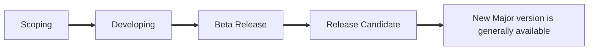
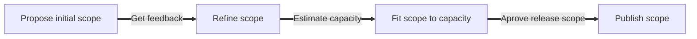
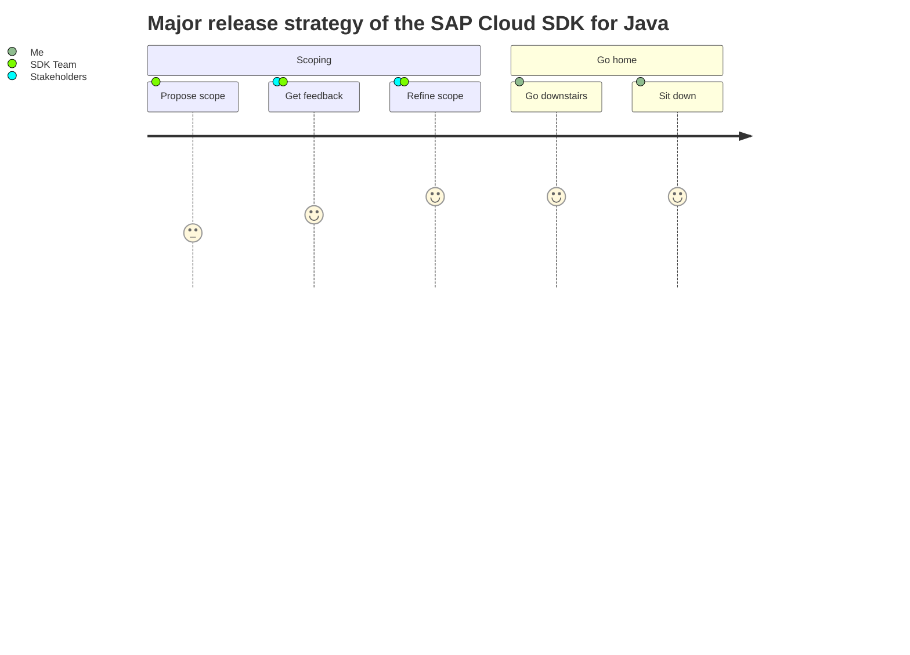

import Tabs from '@theme/Tabs';
import TabItem from '@theme/TabItem';

:::info relevance

This release policy only applies to the SAP Cloud SDK for Java.
Find release policy for the SAP Cloud SDK for JavaScript [here](../js/release-policy.mdx)

:::

## Planned Major Releases

The SAP Cloud SDK for JavaScript follows [semantic versioning](https://semver.org/).

| Version | Status      | Release Date          | Planned scope                                   | Upgrade guide |
|:--------|-------------|:----------------------|:------------------------------------------------|---------------|
| 3.x     | Released GA | January 2019 (fix me) | N/A                                             |               |
| 4.x     | Planned     | July 2022             | [SAP Cloud SDK 4.0](4.0-scope-announcement.mdx) | TBD           |
| 5.x     | Planned     | January 2023          | TBD                                             | TBD           |
| 6.x     | Planned     | July 2023             | TBD                                             | TBD           |


## Minor and Major Release Policy

We follows [Semantic Versioning](https://semver.org/) for our releases.

### Minor release schedule

Our regular **minor version** release happens every **two weeks**.
It includes new functionality, fixes, and maintenance updates that we communicate in the [release notes](./release-notes.mdx).

We change our release frequency rarely to:

  - Provide a **hot fix** patch to the latest minor version release if a critical fix is necessary.
  - To accommodate a longer development cycle we can extend an interval between **minor version** releases.

:::tip  "Upgrading between minor releases"

Usually, an upgrade between minor releases do not involve any effort.
All the changes are incremental.
We do not remove any deprecated code before next major release.

:::


### Major release schedule

We intend to release a new **major version** every **six months** to introduce significant feature upgrades, refactor existing features, and clean up deprecated code.

  - **Major version** release interval is indicative and can be extended.
  - We will announce planned date and scope of the next **major version** release in this [document](#planned-major-release-schedule) and [release notes](./release-notes.mdx) at least 3 months before the planned release date.

### Major release stages



#### Plan


#### Planning [2 months]

 1. Research and scope proposal by the SDK team [2 weeks]
 1. Collecting feedback from customers and other stakeholders [2 weeks]
 1.
|   |   |   |   |   |   |   |
|---|---|---|---|---|---|---|
|   |   |   |   |   |   |   |
|   |   |   |   |   |   |   |


#### Heading


|              | Propose scope  | Get feedback        | Refine and approve scope | Announce scope                         | Develop Beta | Get feedback         | Refine Beta       | GA Release                    |
|:------------:|:--------------:|:-------------------:|:------------------------:|:--------------------------------------:|:------------:|:--------------------:|:-----------------:|:-----------------------------:|
| Time frame   | 1 month        | 1 month             | 2 weeks                  | 1 day                                  | 2 months     | 1 months             | 2 weeks           | 2 weeks                       |
| Stakeholders | SDK Team       | Customers, SDK Team | SDK Team                 | SDK Team                               | SDK Team     | Customers, SDK Team  | SDK Team          | SDK Team                      |
| Result       | Scope proposal | Validated scope     | Approved Scope           | Publish scope and planned release date | Release Beta | List of improvements | Release Candidate | New Major version released GA |




### Upgrading to a New Minor Version

- Upgrade to a new **minor release version** should not involve any effort because we do not introduce breaking changes.

### Upgrading to a New Major Version

- We provide a step-by-step upgrade guide for each major version.
- Following the upgrade steps should take less than a day of development effort regardless of the project size.

### Documentation

- The documentation is always up to date with the **latest major release**.
- We will use tabs to demonstrate a difference between the versions where required.

<Tabs groupId="version" defaultValue="major" values={[ { label: 'SDK 2.x', value: 'major' }, { label: 'SDK 1.x', value: 'deprecated' } ]}>

<TabItem value="major">

```

Major version documentation

```

</TabItem>

<TabItem value="deprecated">

```

Deprecated version documentation

```

</TabItem>

</Tabs>

- We will maintain documentation for the two most recent versions.
- With every new major version release the oldest documented version is removed from the documentation portal.

:::tip

We will always provide a branch with the latest snapshot of the documentation before the major version release.
You can use that branch to host documentation for the earlier version locally.

:::

### Fixes and Maintenance

- We provide new features and fixes only for the **latest major release** of the SAP Cloud SDK for JavaScript.

### Support and feedback

We are happy to hear from you and usually respond within one day.
Check our [support channels](../overview/support.mdx) and chose the one that works best for you.
