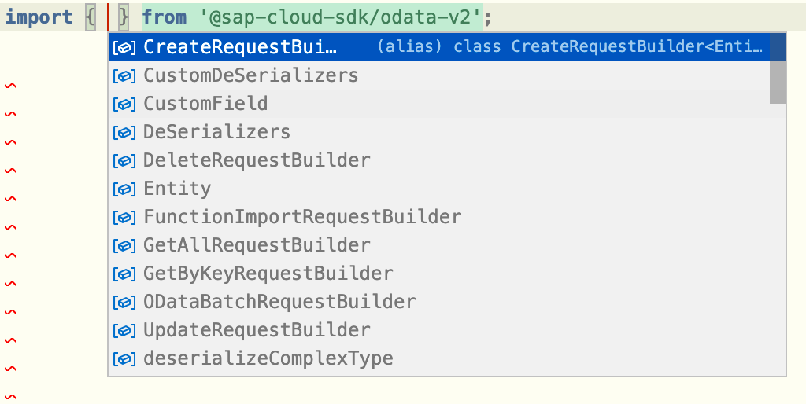
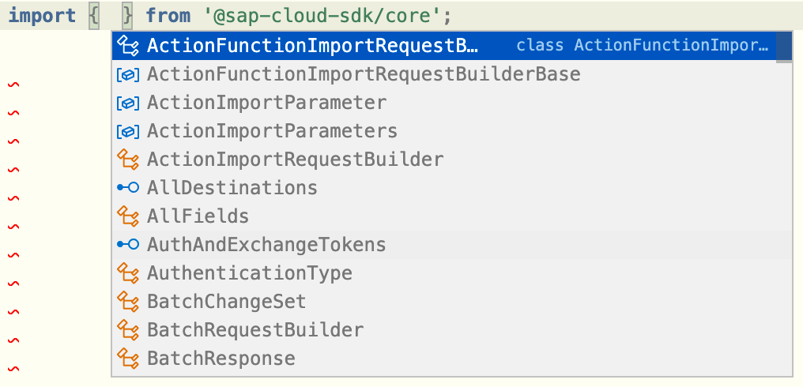
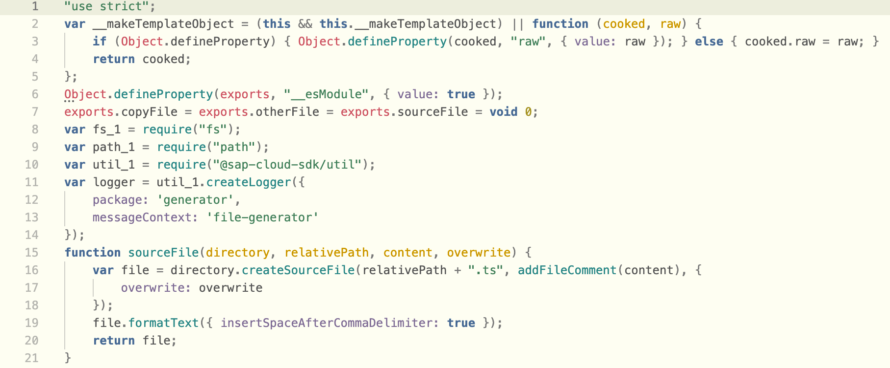
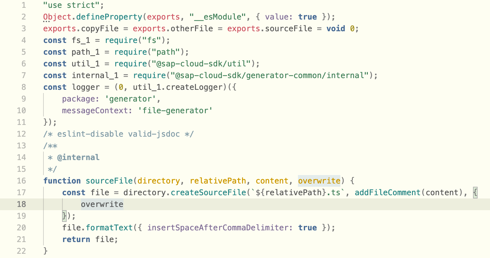

# Announcing Version 2 Beta

## What Is Included in the Beta?

We announced four noteworthy changes for our upcoming version increase:
- Split packages and export only the public interface
- Increase compilation target to ECMAScript 2019
- Remove deprecated functionality
- ~~Replace `moment.js` with a flexible middleware approach for deserialization~~ (postponed)

We think made good progress and would love you to try the beta.
Let's take a look what was achieved so far.

### Split Packages and Export Only the Public Interface

There is no more `@sap-cloud-sdk/core` package anymore.
Instead, there are the following packages:
- `@sap-cloud-sdk/connectivity` (e.g. `getDestination()`)
- `@sap-cloud-sdk/http-client` (e.g. `executeHttpRequest()`)
- `@sap-cloud-sdk/openapi`, `@sap-cloud-sdk/odata-v2` and `@sap-cloud-sdk/odata-v4` (e.g. filter functions, request builder)

Internal functions are not exported in our v2 packages to make it easier to find the right function for your use case.
We expose internals via a special import path, but offer no stability guarantee for this internal interface.

This means you will see this:

rather than this:

### Increase Compilation Target to ECMAScript 2019

This will only affect you if you run your application in a legacy environment.
It makes the compiled JavaScript code a little cleaner, as in this example.

Old:

New:

The differences are minor, but it saves five lines of code in this file alone.

### Remove Deprecated Functionality

We hope you replaced deprecated functionality already.
If not, our upgrade guide lists all removed methods and their replacement.
In total, we removed a bit more than 100 deprecated methods.

### Replace `moment.js` with a Flexible Middleware Approach for Deserialization (Postponed)

There is good progress toward a flexible middleware approach.
Sadly, it is not ready for the beta release yet.
To give you a sneak peek, here is an example for a middleware to serialize `Edm.DateTime`, `Edm.DateTimeOffset` and `Edm.Time` to `temporal`:

## How Can I Use It?

We publish the beta version on `npm`.
You can install it by adding `@beta` after the package name (e.g. `npm install @sap-cloud-sdk/generator@beta`).

::: warning

If you use an OData or OpenAPI client, make sure it was generated with the same version as your other SAP Cloud SDK dependencies.

:::

Check the [upgrade guide](../guides/upgrade-to-version-2.mdx) for detailed instructions how to upgrade.
