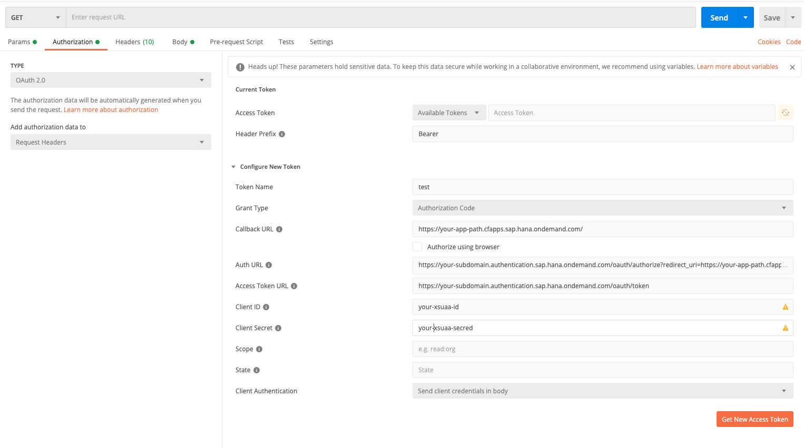

## Overview

A JSON Web Token (JWT) is standardized object containing some structured information.
A JWT contains three parts:
- Header: Containing meta information like hashing algorithm and verification certificates
- Payload: The actual data
- Verify Signature: Signature of the Header and Payload for verification

Given a JWT, you can use the information from the header and signature to check if the JWT is valid.
Therefore, JWTs are used to exchange authorization and authentication information between applications.
Also SAP has chosen the JWT format to pass authentication related claims.

## JWT in SAP BTP

We will not go into details how to setup an application with the approuter and XSUAA service.
Have a look at the sample applications for [SAP Cloud Foundry](https://github.com/SAP-samples/cloud-sdk-js/tree/main/samples/cf-sample-application) and [k8s](https://github.com/SAP-samples/cloud-sdk-js/tree/main/samples/k8s-sample-application).
The high level flow is as follows:

- User wants to access a protected resource and is not yet authenticated
- Approuter redirects the request to the IdP
- After some [back and forth](## Obtain JWT programmatically) the XSUAA issues a JWT
- Approuter adds the JWT to the request headers and redirects the request to initially requested resource

:::caution Caution
A JWT has a limited lifetime but is nevertheless a sensitive security object.
So do not log complete JWTs in the application, share them with others or use online tools to decode them.
:::

## Use JWT in Application

After the approuter, IdP and XSUAA did their magic the JWT is a request header.
The SAP Cloud SDK has a convenience method to extract the JWT from the request object.
For [NestJS](https://nestjs.com/) the code would look like:

```ts
import { Controller, Get, Req } from '@nestjs/common';
import { Request } from 'express';
import { retrieveJwt } from '@sap-cloud-sdk/connectivity';

@Controller()
export class AppController {
  constructor() {}

  @Get('some-sample-endpoint')
  getSomeSampleEndpoint(@Req() request: Request): Promise<void> {
    const myJwt = retrieveJwt(request);
    //Do something with the JWT e.g. fetch some data using a destination
  }
}
```

Note that the SAP Cloud SDK uses the `Request` object from [express](https://expressjs.com/), which makes a usage in this popular framework also simple.
In case you use a different framework, the [implementation](https://github.com/SAP/cloud-sdk-js/blob/6e3453e50a061d3ea2dbd9ac6a40232e624f348f/packages/connectivity/src/scp-cf/jwt.ts#L45-L63) in the `retrieveJwt()` is simple.
Effectively it takes `authorization` header value ("Bearer yourJwtTokenBase64Encoded") and extracts the token value:

```ts
const myToken = headers.authorization.split(' ')[1];
```

Once you have the JWT at hand, you can use it to get data [from other systems](../features/odata/execute-odata-request.mdx) or make calls to the [destination service](../features/connectivity/destination#destination-service).
Note that the [destination service](../features/connectivity/destination.mdx#destination-service) will perform token exchange flows for you if configured accordingly.
This means the initial JWT is transformed to a `SAMLBearerAssertion` or `ClientCredentials` grant.

## Obtain JWT locally

For a faster feedback cycle it is sometimes convenient to test things locally without a deployment to the SAP BTP.
In some cases your application will rely on a JWT to set scopes or propagate a user to external systems.
In such a test scenario you need to fetch the JWT manually.

Postman supports the `OAuth 2.0` flow used by the IdP and XSUAA.
Hence, it is simple to get a token via Postman:

- Create a new request
- Go to the `Authorization` tab of the request
- Select `Oauth 2.0` as a type
- Fill the following values in the user interface:
  - `Callback URL`: Path to the application protected by the XSUAA
  - `Auth URL`: Path to the authentication endpoint using your subdomain and the values for the callback URL e.g. `https://<subdomain>.authentication.sap.hana.ondemand.com/oauth/authorize?redirect_uri=<callbackUrl>`
  - `Token URL`: Path to the token endpoint using your subdomain e.g. `https://<subdomain>.authentication.sap.hana.ondemand.com/oauth/token`
  - `Client ID` and `Client secret` for the XSUAA service (either VCAP variables or service keys)
  - Do not check the `Authorize using browser checkbox`
- Press the `Get new access token` button to retrieve a token
- Postman will open a window showing the IdP login form
- Enter username and password
- Postman shows the retrieved token and you can copy it

Cookies will remember the entered username and password.
This makes re-fetching a new token super quick when your old token is expired.
Remove the cookies in case you want to start fresh.



## Obtain JWT programmatically

In some situations, it is not possible to use a UI based approach like Postman or the browser to retrieve a JWT.
If you want to retrieve a JWT programmatically you have to implement the `OAuth 2.0` flow or rely on a library to do that for you.
We have done this for our internal E2E tests and the implementation involves many steps and is a bit tricky.
We will give a high level overview.
In case you also need an implementation, investigate the steps in the debug console of your browser when you do a login.

- First step is to retrieve a `code` from the XSUAA
- Initial GET request on XSUAA: `https://<xsuaaUrl>/oauth/authorize?client_id=<clientId>&redirect_uri=<redirectUri>&response_type=code`
- This will provide cookies for all upcoming XSUAA requests
- Retrieve a SAML request from the XSUAA: `https://<xsuaaUrl>/saml/login/alias/<subdomain>.<host>`
- Transform the SAML request into a SAML response via the IdP.
  This involves multiple redirected requests with a lot of cookies and request parameters passed around.
  In the browser redirects with the `set-cookie` and `location` headers work well.
  In node most http clients do not handle the redirects correctly and a manual redirect on 302 response needs to be implemented.
- Once you have the SAML response, call the XSUAA to retrieve the `code` in the location header
- Use the `code` with clientId and clientSecret to get a JWT token from the XSUAA service
